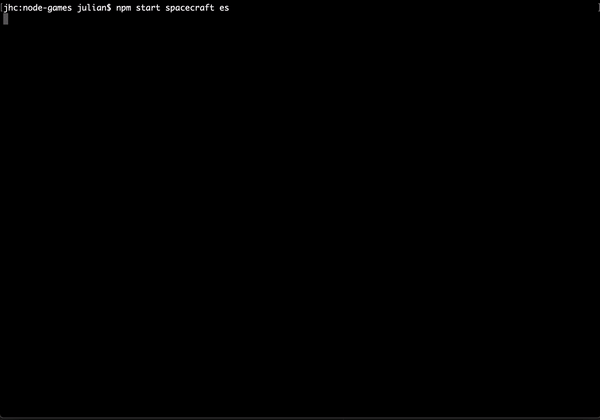
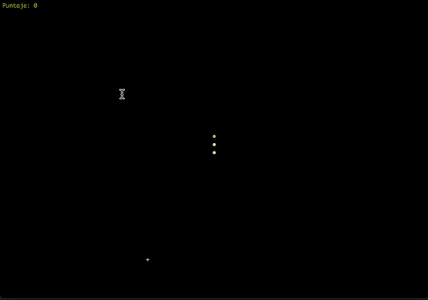
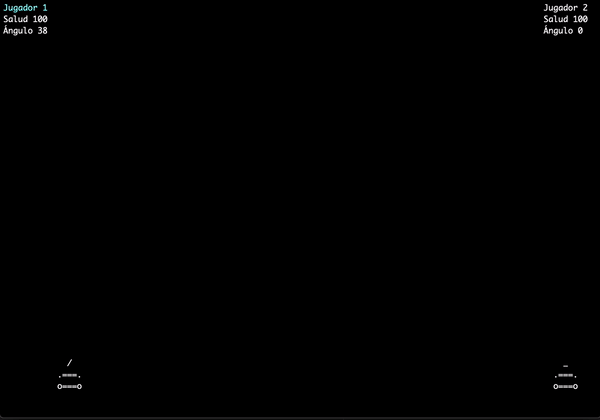

node-games
==========

[English Version](README.md)

Algunos juegos de consola escritos en Node.

```
npm i -g node-games

node-games
```

Sin instalar el juego globalmente:
```
npm start <juego> <idioma>

Ejemplo:
npm start snake es

(Si no se especifica el lenguage, por defecto se usa inglés)
```

spacecraft
----------


snake
-----


tanks
-----

